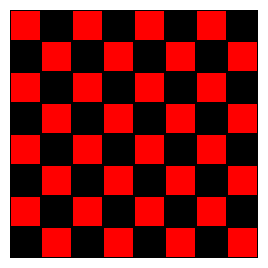

# Doodle

Doodle is a Scala library for 2D graphics, animation, data visualization, and creative coding. It runs in both the JVM, rendering via [Java2D][java2d], and the web browser using [SVG][svg].


## Getting Started

To use Doodle, add the following to your `build.sbt`

```scala
libraryDependencies += "org.creativescala" %% "doodle" % "@VERSION@"
```


## ScalaDoc

See the ScalaDoc @:api(doodle.index) for API documentation.


## Quick Example

The following example creates a Chessboard, by first creating a 2x2 board, then a 4x4 board from the 2x2 board, and finally the complete 8x8 board from the 4x4 board.


```scala mdoc:silent
// The "Image" DSL is the easiest way to create images
import doodle.image._
// Colors and other useful stuff
import doodle.core._

val blackSquare = Image.rectangle(30, 30).fillColor(Color.black)
val redSquare = Image.rectangle(30, 30).fillColor(Color.red)

// A chessboard, broken into steps showing the recursive construction
val twoByTwo =
  (redSquare.beside(blackSquare))
    .above(blackSquare.beside(redSquare))

val fourByFour =
  (twoByTwo.beside(twoByTwo))
    .above(twoByTwo.beside(twoByTwo))

val chessboard =
  (fourByFour.beside(fourByFour))
    .above(fourByFour.beside(fourByFour))
```

To draw these Images call the `draw` method like so


```scala
// Extension methods
import doodle.image.syntax.all._
// Render to a window using Java2D (must be running in the JVM)
import doodle.java2d._
// Need the Cats Effect runtime to run everything
import cats.effect.unsafe.implicits.global

chessboard.draw()
```

This creates the picture shown below.




### Attention IntelliJ Users

The Scala Plugin of IntelliJ still has an open bug which cannot resolve implicits correctly. The above example might give you an Error warning in Line XX. You can ignore this warning, or fix it using `chessboard.draw[Algebra, Frame, Canvas]()`. Please use any text editor and [Metals](https://scalameta.org/metals/) to get a better experience using Doodle.


## Learning Doodle

- To get started drawing pictures, read the [Creating Pictures](pictures/README.md) chapter.
- To understand the concept behind Doodle, start with the [Core Concepts](concepts/README.md) chapter.

[java2d]: https://en.wikipedia.org/wiki/Java_2D
[svg]: https://en.wikipedia.org/wiki/SVG
[expression-problem]: https://en.wikipedia.org/wiki/Expression_problem
