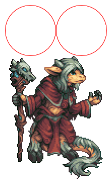
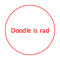

# Using Algebras

This section gives recipes for using Doodle's algebras, targetting one backend or working across multiple backends. You should be familiar with the [concepts](../concepts/README.md) behind Doodle to understand everything here.


## Using a Single Backend

Using a single backend should be straightforward:

1. Import the Doodle core, syntax, and the backend you're using.
2. Construct pictures using the methods on the `Picture` object.
3. Compose `Pictures` using the methods provided by the syntax imports.

For example, the following imports are used for the Java2D backend:

```scala mdoc:silent
import doodle.java2d._
import doodle.core._
import doodle.syntax.all._
```

Given these imports we can create pictures. To construct atomic elements we call the constructors on `Picture`.

```scala mdoc:silent
val smallCircle = Picture.circle(100)
val largeSquare = Picture.square(200)
```

When we have some pictures we can compose them using the methods provided by the syntax import.

```scala mdoc:silent
val composition =
  smallCircle
    .fillColor(Color.crimson)
    .noStroke
    .on(largeSquare.fillColor(Color.midnightBlue).strokeWidth(5))
```

Naturally we might want to draw our creation. For this we need another import


```scala mdoc:silent
import cats.effect.unsafe.implicits.global
```

Now we can call `draw`

```scala
composition.draw()
```

producing the masterpiece shown below.


As we've seen, using the algebras is mostly as simple as using `Image`. The only issue you might see is that the error messages can be a bit harder to interpret.


## Using Backend Specific Features

Using backend specific features follows the same pattern as using a single backend. Here's an example using the @:api(doodle.algebra.Bitmap) algebra, which is currently only supported by the @:api(doodle.java2d) backend. (The bitmap used is the [Old God](https://www.deviantart.com/kaiseto/journal/Most-of-my-Pixel-Art-is-now-Creative-Commons-369510391) created by Kevin Chaloux and released under Creative Commons.)

The first step is, as before, to import the Doodle core, Java2D backend, syntax extensions, and the Cats Effect runtime.

```scala mdoc:reset:silent
import doodle.core._
import doodle.java2d._
import doodle.syntax.all._
import cats.effect.unsafe.implicits.global
```
Now we can go about creating our picture, using the `read` method to load a bitmap image.

```scala mdoc:silent
val redCircle = Picture.circle(100).strokeColor(Color.red)
val twoRedCircles = redCircle.beside(redCircle)
val oldGod = Picture.read("old-god.png")
```

We can combine this bitmap value with other pictures in the usual way.

```scala mdoc:silent
twoRedCircles.above(oldGod)
```

We can then draw it using the `draw` method, which produces the output shown below.




## Creating Cross-Backend Pictures

Targeting multiple backends requires a little bit more work than working with a single backend. We can't use the usual constructor methods on a `Picture` object, as those methods target a specific backend and we want to work across multiple backends. However, every constructor method has a syntax equivalent that we can call. So to create a circle we can write

```scala mdoc:reset:silent
import doodle.core._
import doodle.syntax.all._

circle(100)
```

Once we know how to do this, everything proceeds as before. Here's a complete example.

```scala mdoc:silent
val redCircle = circle(100).strokeColor(Color.red)
val rad = text("Doodle is rad")
  
val picture = rad.on(redCircle)
```

We can then `draw` the picture as before. In this case we get the output below.




## Using Raw Algebras

We never need to call methods on algebras directly. Doodle provides the @:api(doodle.algebra.Picture) abstraction and lots of @:api(doodle.syntax) to avoid this. However, if some reason you did want to use algebras directly here is how to do it. Understanding this does help a bit in understanding the utilities that Doodle provides to avoid using algebras directly.

To use algebras directly, write a method with a parameter that is the algebras that you need. For example, if we were to write a simple program using `Layout`, `Style`, and `Shape` we might write the following.

```scala mdoc:silent
import doodle.core._
import doodle.algebra._

// Two red circles beside each other
def twoRedCircles[Alg <: Layout & Style & Shape](algebra: Alg): algebra.Drawing[Unit] = {
  val redCircle = algebra.strokeColor(algebra.circle(100), Color.red)
  
  algebra.beside(redCircle, redCircle)
}
  
```

This is not a convenient way to write code, so don't do it unless you have a good reason.
