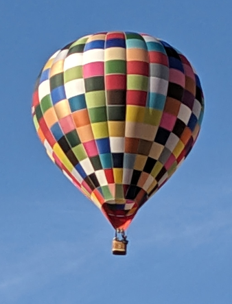

# Bitmaps in Canvas

The Canvas backend provides methods to load bitmap images in the various types provided by the web platform (i.e. the browser) and convert them to a Doodle `Picture`.


## Loading Bitmaps

Bitmap images can be loaded from URLs using the @:api(doodle.algebra.LoadBitmap) algebra. Bitmaps can be represented as either a [`HTMLImageElement`][html-image-element] or an [`ImageBitmap`][image-bitmap].
`HTMLImageElement` is the standard DOM image element, while `ImageBitmap` is optimized for faster rendering.

Both instances of @:api(doodle.algebra.LoadBitmap) have the same input: a `String` specifying the URL from which to load the image. To distinguish between these instances you need to specify the output type when calling the `loadBitmap` method. URLs can be familiar URLs like `https://creativescala.org/` and also data URLs containing Base64 encoded bitmaps.
The example below shows a bitmap being loaded from a data URL into both the available type. It also demonstrates the necessary imports.

```scala
import cats.effect.unsafe.implicits.global
import doodle.canvas.{*, given}
import doodle.syntax.all.*
import org.scalajs.dom

// Image as a Base64 encoded URL
val url =
  "data:image/png:base64,iVBORw..."

// Load as HTMLImageElement
val htmlImage = url.loadBitmap[dom.HTMLImageElement]

// Load as ImageBitmap (GPU-optimized)
val imageBitmap = url.loadBitmap[dom.ImageBitmap]
```


## Converting Bitmaps to Picture

The Canvas backend has implementations of the @:api(doodle.algebra.ToPicture) algebra for `HTMLImageElement` and `ImageBitmap`, which allows them to be converted to a `Picture`. Take, for example, the image below.



With the following code we can find its `HTMLImageElement` in the DOM, turn it into a `Picture`, and then work with it using the normal Doodle methods.

```scala
import cats.effect.unsafe.implicits.global
import doodle.canvas.{*, given}
import doodle.syntax.all.*
import org.scalajs.dom

val img =
  dom.document.querySelector("img").asInstanceOf[dom.HTMLImageElement]
val picture = img.toPicture.scale(0.5, 0.5).horizontalReflection
picture.drawWithFrame(Frame(id))
```

The result is shown below.

@:doodle("to-html-image-picture", "CanvasToPictureExamples.toHtmlImagePicture")


## Complete Example

This example combines `loadBitmap` and `toPicture`, loading a Creative Commons bitmap from WikiMedia.

```scala
import cats.effect.unsafe.implicits.global
import doodle.canvas.{*, given}
import doodle.core.*
import doodle.syntax.all.*
import org.scalajs.dom

// Scaled down version of https://commons.wikimedia.org/wiki/File:A_Koch_woman.jpg
//
// Used under CC license https://creativecommons.org/licenses/by-sa/4.0/deed.en
val wikimediaUrl =
  "https://upload.wikimedia.org/wikipedia/commons/thumb/a/aa/A_Koch_woman.jpg/330px-A_Koch_woman.jpg"

val program = for {
  htmlImg <- wikimediaUrl.loadBitmap[dom.HTMLImageElement].toPicture
  imgBitmap <- wikimediaUrl.loadBitmap[dom.ImageBitmap].toPicture

  composite = htmlImage.beside(imgBitmap)

  _ <- composite.drawWithFrameToIO(Frame(id))
} yield ()

program.unsafeToFuture( )
```

Here's the result of this program.

@:doodle("canvas-load-bitmap", "CanvasLoadBitmapExamples.demo")

[html-image-element]: https://developer.mozilla.org/en-US/docs/Web/API/HTMLImageElement
[image-bitmap]: https://developer.mozilla.org/en-US/docs/Web/API/ImageBitmap
